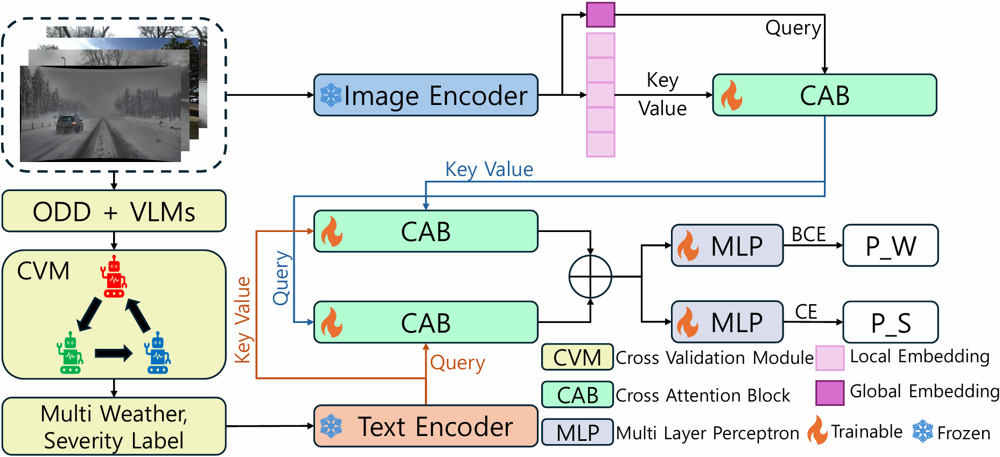

# Multi-Modal Cross-Attention based Multi-Label Weather and Severity Level Classification



## Requirements
```
# create conda env
conda create -n MWSC python=3.11.8
conda activate MWSC

# install packages
pip install -r requirements.txt

# Install the according versions of torch and torchvision
conda install pytorch torchvision cudatoolkit
```

## Preparing Datasets
Download each dataset from the official website ([ACDC](https://acdc.vision.ee.ethz.ch/), [DEEP BLUE](https://deepblue.lib.umich.edu/data/concern/data_sets/cc08hg37c?locale=en), [DENSE](https://www.uni-ulm.de/en/in/driveu/projects/dense-datasets), [SODA10M](https://soda-2d.github.io/)) and put them under local directory like /data/all. The structure of /data can be organized as follows:
```
└── data
    └── all
        ├── Clear
        │   ├── {ACDC Normal images}
        │   ├── {DEEP BLUE Clear images}
        │   ├── {DENSE Clear images}
        │   └── {SODA10M Clear images}
        ├── Foggy
        │   ├── {ACDC Foggy images}
        │   └── {DENSE Foggy images}
        ├── Rainy
        │   ├── {ACDC Rainy images}
        │   ├── {DEEP BLUE Rainy images}
        │   ├── {DENSE Rainy images}
        │   └── {SODA10M Rainy images}
        └── Snowy
            ├── {ACDC Snowy images}
            ├── {DEEP BLUE Snowy images}
            └── {DENSE Snowy images}
    └── label
        ├── train_data.csv
        ├── val_data.csv
        ├── test_data.csv
        ├── real_time_test_data_1.csv
        ├── real_time_test_data_2.csv
        └── real_time_test_data_3.csv
```
Pre-trained models can be downloaded [here](https://drive.google.com/drive/folders/1JnxlWd5CMrqO23dzcrNDuMrPldKyq_tA?usp=drive_link).

## Train
We provide train.sh and train_finetune.sh, which can run training with a single-line command.
```
# train on mwsc
bash scripts/train.sh

# train on other model
bash scripts/train_finetune.sh
```
### Arguments
+ ```clip_base_model``` is the name of the backbone network of CLIP visual coders that will be used (e.g. ViT-B/16, ViT-B/32, ViT-L/14).
+ ```timm_model_name``` is the name in timm of the model to be fine-tuned (e.g. resnet50, vit_base_patch32_clip_224, poolformerv2_m48).
+ ```learning_rate``` learning rate for adapter training.
+ ```pretrain``` Whether to pretrain the model for fine tuning.
+ ```ablation_mode``` Variables for ablation studies. (1: baseline, 2: no attention, 3: global-local cross attention, 4: image-text cross attention)

More arguments can be referenced in params.py.

## Test
You can test mwsc using ```test.ipynb``` and test the comparison models using ```test_finetune.ipynb```. When testing, don't forget to check the variables at the top (e.g. model name, whether pretrained, path settings, etc.).
